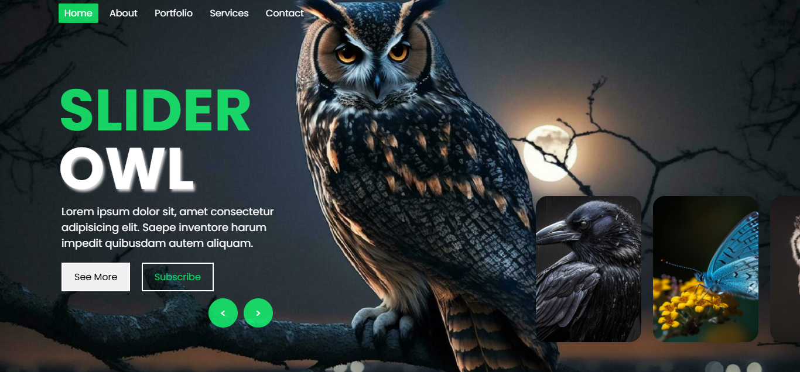

# Image Slider

A fully responsive and visually engaging image slider featuring birds and animals. The slider supports automatic transitions, manual navigation, and interactive slide content.

## Features

- Responsive full-screen layout for all screen sizes  
- Auto-sliding every 5 seconds with animated progress bar  
- Manual navigation via next and previous buttons  
- Stylish content overlays for each slide with title, description, and actions  
- Navigation header with active state tracking  

## Files Included

- `index.html` — HTML layout for the image slider  
- `style.css` — Styled with responsive layout and animations  
- `script.js` — Contains slider logic and auto-navigation functionality  

## Screenshot

## How to Use

1. Open `index.html` in your browser.  
2. View the image transitions automatically or click **Next** and **Previous** to navigate.  
3. Click on **See More** or **Subscribe** for action buttons on each slide.  

## Future Improvements

- Pause on hover for better user control  
- Keyboard navigation  
- Swipe gestures for touch devices  
- Slide indicators or thumbnails for navigation  

---

**Made with ❤️ using HTML, CSS, and JavaScript**
